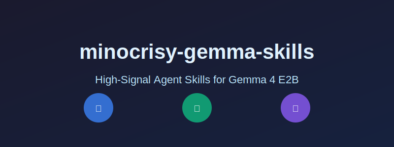

# minocrisy-gemma-skills

<p align="center">
  
</p>

> **Private, offline cognitive tools for serious thinking.**  
> Precision instruments that activate on-device when you need them.

<p align="center">
  <a href="https://ai.google.dev/gemma"></a>
  
  <a href="LICENSE"></a>
  <a href="CATALOG.md"></a>
</p>

Private, offline cognitive tools for people who already have strong cloud models (Grok, Gemini, Claude, etc.) and want sharp, reliable thinking tools that never leave the device.

## What This Is

**A focused collection of high-leverage instruction sets** for Gemma 4 E2B running in Google AI Edge Gallery.

These skills follow strict progressive disclosure: the model only loads the full instructions when the name + description indicates the skill is relevant. The result is fast, private, high-signal reasoning without bloating every prompt.

They are deliberately narrow, deliberately tested, and deliberately anti-fluff.

## Philosophy

- **Direct, not diplomatic.** Minimal hedging.
- **High leverage** over broad coverage.
- **High signal-to-noise.** No corporate language, no motivational fluff.
- **Progressive disclosure:** the model sees only name + description until the skill is relevant.
- Designed to **complement** cloud tools, not replace them.
- Tested on actual hardware with Gemma 4 E2B before shipping.

If a skill does not meaningfully improve private serious work, it does not belong here.

## Skills at a Glance

| Skill | Primary Purpose | Status |
|-------|-----------------|--------|
| [First Principles Decomposer](skills/first-principles-decomposer/SKILL.md) | Break problems down to axioms before rebuilding | Tested & Validated |
| [Pre-Mortem Analyzer](skills/pre-mortem-analyzer/SKILL.md) | Surface failure modes before committing | Tested & Validated |
| [Assumption Challenger](skills/assumption-challenger/SKILL.md) | Stress-test hidden assumptions | Tested & Validated |
| [Decision Framework Builder](skills/decision-framework-builder/SKILL.md) | Structured criteria, weighting, and trade-offs | Tested & Validated |
| [Goal to Atomic Action Decomposer](skills/goal-to-atomic-action-decomposer/SKILL.md) | Convert intent into smallest executable steps | Tested & Validated |
| [Root Cause Analyzer](skills/root-cause-analyzer/SKILL.md) | Move from symptoms to systemic causes | Needs Work |
| [Devil’s Advocate Simulator](skills/devils-advocate-simulator/SKILL.md) | Systematic pressure-testing of reasoning | Needs Work |
| [Local Decision Journal](skills/local-decision-journal/SKILL.md) | Persistent tagged decisions with search & filters | Shipped |
| [Skill Architect](skills/skill-architect/SKILL.md) | Generate or refactor skills to repo standards | Shipped (Meta) |
| [Skill Update Reminder](skills/skill-update-reminder/SKILL.md) | Guidance for refreshing cached skills | Shipped (Meta) |

See [CATALOG.md](CATALOG.md) for versions, detailed descriptions, and on-device notes.

## Current Status

### Tested & Validated on Gemma 4 E2B
- decision-framework-builder
- first-principles-decomposer
- pre-mortem-analyzer
- assumption-challenger
- goal-to-atomic-action-decomposer

### Shipped (Meta & Supporting)
- local-decision-journal
- skill-architect
- skill-update-reminder

### Needs Improvement
- root-cause-analyzer
- devils-advocate-simulator

All skills are versioned. Google AI Edge Gallery caches locally — re-add the raw URL to receive updates.

## Installation

1. Open **Google AI Edge Gallery** on iOS or Android.
2. Go to **Agent Skills**.
3. Tap **+** to add a custom skill.
4. Paste the raw URL:

```
https://raw.githubusercontent.com/Minocrisy/minocrisy-gemma-skills/main/skills/<skill-name>/SKILL.md
```

**Example:**

```
https://raw.githubusercontent.com/Minocrisy/minocrisy-gemma-skills/main/skills/local-decision-journal/SKILL.md
```

## Keeping Skills Updated

Google AI Edge Gallery caches imported skills. To update:

1. Remove the old skill.
2. Re-add using the same raw URL.

Check the `version:` field in the skill file or [CATALOG.md](CATALOG.md). The [Skill Update Reminder](skills/skill-update-reminder/SKILL.md) skill provides in-app guidance.

## Repository Layout

- `skills/` — One folder per skill containing a single `SKILL.md`
- `CATALOG.md` — Complete index with status, versions, and notes
- `QUALITY-STANDARDS.md` — The non-negotiable bar for inclusion
- `CONTRIBUTING.md` — How to propose or add new skills

## License

Apache-2.0 — see [LICENSE](LICENSE).

---

<p align="center">
  <sub>Truth-seeking tools. Zero fluff. Built for the edge.</sub>
</p>
